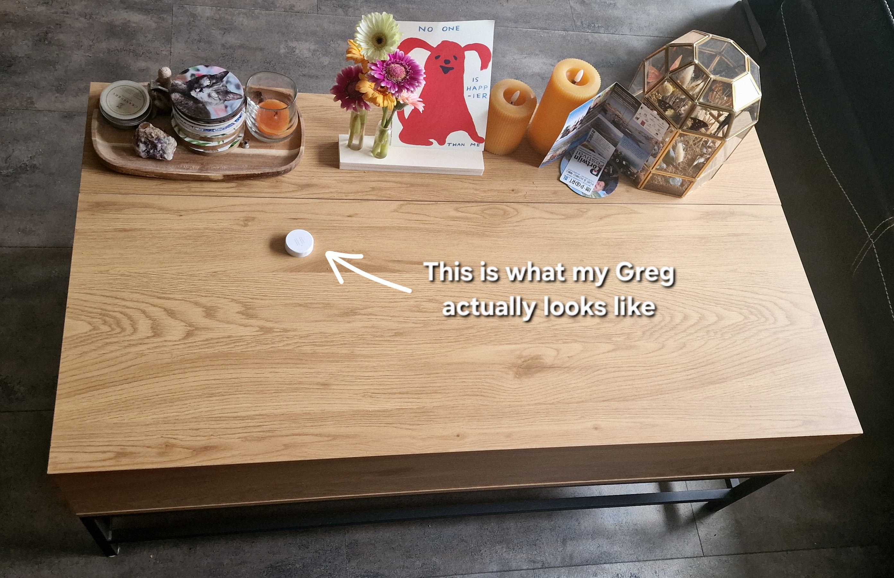
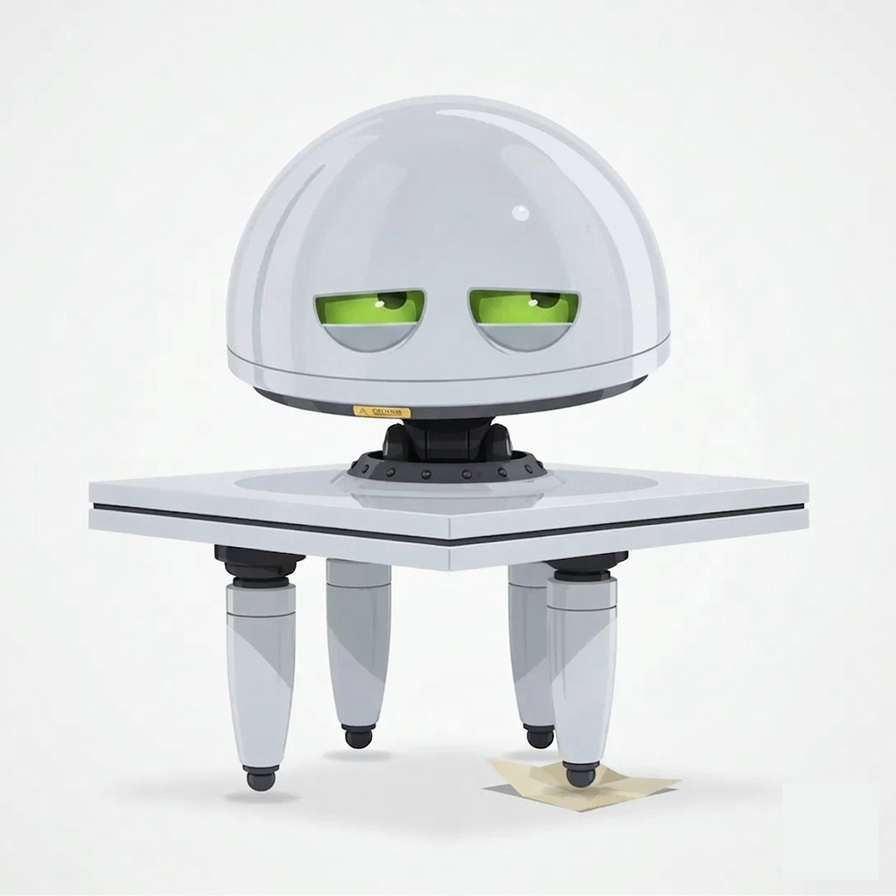
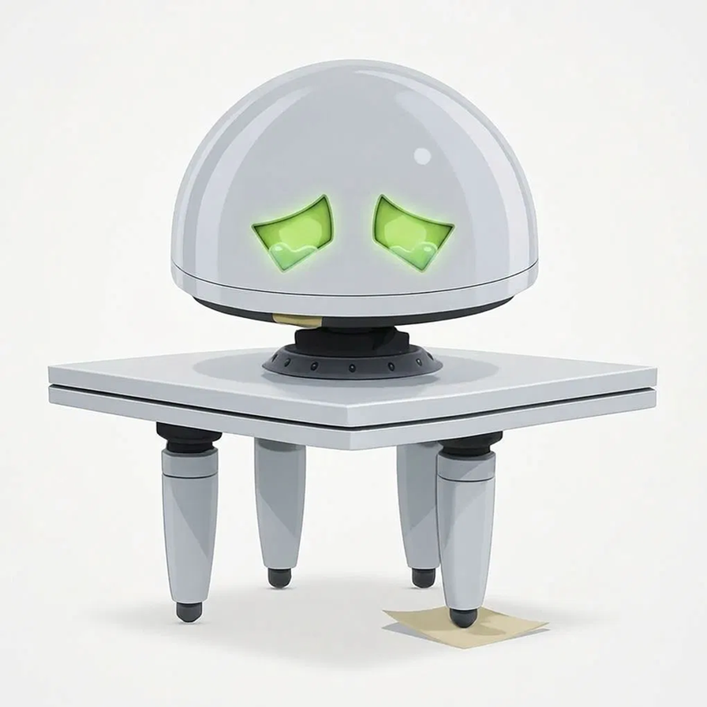
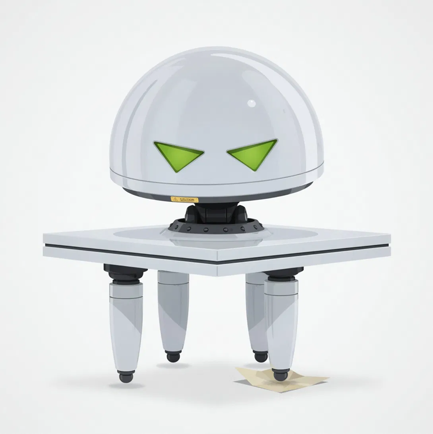
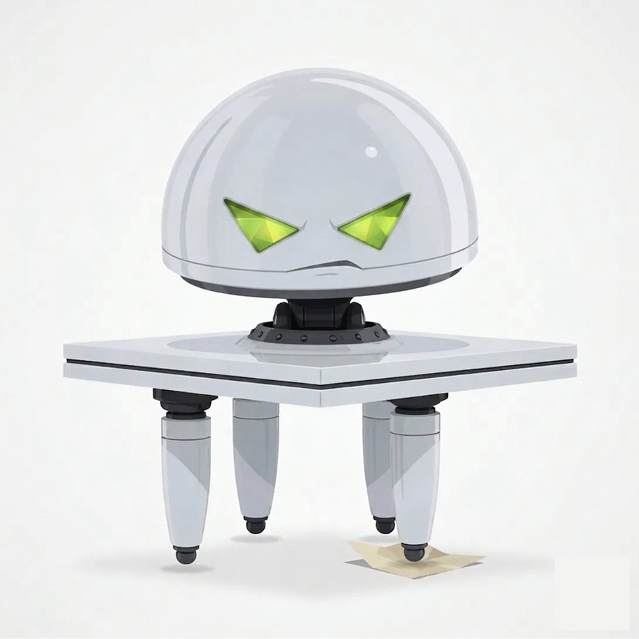

# Greg

**A Home Assistant integration that gives your coffee table feelings. Mostly bad ones.**

---

*Greg's his own character. He was clearly built by the same company that made Marvin, though, and nobody knows why they did it twice.*

---

## How Greg happened

It actually started with a vibration sensor. Something I bought thinking "this'll come in handy for an automation one day," then never used. The plan was to trigger a group of lights by sitting somewhere specific, or maybe banging on my desk. Wasn't useful enough for my setup, so it sat in a drawer collecting dust.

I found it again while tidying up. I wasn't about to bin a basically-new sensor and add to the e-waste pile, but every practical use I looked at just didn't fit my place. Some of them were really clever, too. Still no good for me. So there I was, stuck with a sensor and no purpose for it. Again.

Then I thought, if practical won't work, how about funny? Still useless, just fun. I love a good laugh.

Now, weeks before any of this, I'd been talking friends' ears off about the Marvin film. Then Douglas Adams, then pretty much everything he wrote. I'd never read or heard anything like that humour and narration, and I've loved it ever since. So I'm stood there staring at the sensor on our coffee table, next to the smart speaker we only ever ask for the weather, and it clicked. The automatic doors. That dripping, hopeless voice. I didn't want to copy Marvin himself. That character's already perfect, and it isn't mine to take. I wanted something that felt like it came off the same production line. Same factory, different unit.

Off I went. It started as a pile of automations and helpers. Fragile, fiddly, about 25 lines in total, which gets old fast even for a joke. But I'm stubborn enough not to quit on something silly, so I kept going. The sidebar panel happened because I wanted it dead-easy for someone else to install and laugh at, no DIY-ing a dashboard card afterwards. I didn't even know I needed GitHub at that point. Didn't matter. I was three weeks of evenings deep into something stupid and determined to make it stupidly good.

I'm 46. The learning curve on all of this was near-vertical for me. On my own, doing it properly, I'd have spent years just learning the skills involved before I could even start. Literally years. I didn't have years, and Arc, my AI pair-programmer for the whole build, is the only reason it happened in the time it did. If Greg's a daft idea that hands you a good one, I'll call that a win. Other people's ideas are what helped inspire me to build him in the first place.

I also tend to ramble. Sorry. Arc did try to stop me.

---

## What Greg actually does

Attach a vibration sensor to a surface, point Greg at a speaker, and he'll have something to say about everything going on around him. He watches that sensor and reacts to how busy things get. The more the table gets disturbed, the more wound up he gets.

- **A soft touch.** Someone brushed the table. Greg noticed. Greg always notices.
- **A bit of activity.** Things are happening. Greg is unimpressed.
- **Full chaos.** The whole household's at it. Greg has opinions about all of it.
- **Existential crisis.** Unprompted, roughly every 42 minutes if the room's been active. Greg's been thinking again.
- **Silence.** Twenty minutes of nothing and Greg exhales. Metaphorically. He's a table.

He started life with about 25 lines in total. He's got 125 now, 25 for each reaction, all written in the spirit of Douglas Adams. No direct quotes. Just the same DNA.

<em>How Greg sees himself. He has seen what you did, by the way.</em>

---

## What you'll need

Not much, honestly.

- Home Assistant 2025.1.0 or later
- Any binary sensor that detects vibration. Zigbee, Z-Wave, ZHA, Matter, WiFi, the protocol doesn't matter.
- Any media player with TTS support, so Greg has a voice.

---

## Installing Greg

If I did my job right, this is the easy part.

### Via HACS (the easy way)

1. Open HACS in Home Assistant
2. Go to **Integrations**
3. Click the three dots in the top right corner
4. Select **Custom repositories**
5. Add `https://github.com/WHISTLER-Arc/Greg` and select **Integration**
6. Search for **Greg** and install
7. Restart Home Assistant
8. Go to **Settings > Devices & Services > Add Integration** and search for **Greg**

### Manually

1. Copy the `custom_components/greg` folder into your HA `config/custom_components/` directory
2. Restart Home Assistant
3. Go to **Settings > Devices & Services > Add Integration** and search for **Greg**

---

## Setting him up

The setup wizard keeps things simple, unless you want to get into the weeds.

**Simple (this is most people):**

- Pick your vibration sensor
- Pick your speaker
- Set the volume
- Set quiet hours if you want them
- That's it

**Advanced (tick the box if you're feeling brave):**

- Tune the vibration thresholds for each reaction level
- Change how long the room has to be quiet before silence mode kicks in
- Adjust how often the existential crises hit
- Fiddle with sensitivity
- Toggle chime suppression

---

## Giving Greg the right voice

Greg will talk through any TTS engine, but he was *written* for one voice in particular. If you want the full effect, that slow, defeated delivery, run him through **Piper** with the **English (GB) "Alan"** voice. Google Translate TTS is a perfectly fine default to get going. Alan is what makes Greg actually sound like Greg.

### Installing Piper in Home Assistant

Piper is a fast text-to-speech engine that runs fully local on your own hardware. No cloud account, and nobody bills you per character, which suits a table with no income.

1. Go to **Settings → Add-ons → Add-on Store**.
2. Search for **Piper** and click it. (If it isn't listed, the **Wyoming** integration and the official add-on repo ship with HA by default. Just make sure **Advanced Mode** is on in your user profile.)
3. Click **Install**, then **Start**. Turn on **Start on boot** and **Watchdog**.
4. Go to **Settings → Devices & Services**. HA should auto-discover the Piper Wyoming service, so click **Configure** to add it. If it doesn't show up, add the **Wyoming Protocol** integration manually and point it at `localhost:10200`.
5. Piper now appears as a `tts.*` entity. You'll pick it as Greg's TTS engine in the next step.

### The Marvin voice settings

In the Piper add-on config, set the voice and tune it for that exhausted, defeated drawl:

- **Voice:** `en_GB-alan` (shown as `alan` in some Piper interfaces)
- **Quality:** `Medium` or `High`, depending on your hardware
- **Length Scale:** `1.3` to `1.5`. Slows speech right down for that dragging, defeated delivery.
- **Speaking Cadence / sentence pause:** `0.7` to `0.8`. Adds pauses between clauses to really sell the misery.

Length Scale is the big one. It's what turns a neutral British voice into something that sounds like it's given up. Start at `1.4` and adjust to taste.

### Pointing Greg at Piper

Once Piper's running, open **Settings → Devices & Services → Greg → Configure** and set the **Text-to-speech engine** to your Piper `en_GB-alan` entity. No restart needed. Greg picks it up on his next reaction.

> **Credit:** these settings come from the Home Assistant community's "Marvin the depressed voice assistant" thread and the Piper/Rhasspy voice docs:
> - [r/homeassistant, Marvin the depressed voice assistant](https://www.reddit.com/r/homeassistant/comments/1djh5bw/marvin_the_depressed_voice_assistant/)
> - [HA Community, Piper add-on configuration options](https://community.home-assistant.io/t/piper-add-on-configuration-options-per-voice-or-at-runtime/850302)
> - [Piper voice samples](https://rhasspy.github.io/piper-samples/)
> - [Piper VOICES.md](https://github.com/rhasspy/piper/blob/master/VOICES.md)

---

## A heads-up about Google speakers

Greg tries to suppress the little connection chime that Google and Nest speakers play before TTS. It doesn't always work, and that's not Greg's fault. The chime is baked into the device firmware by Google, and there's nothing the integration can do about it. If it won't suppress on your speaker, that's the hardware doing it, nothing Greg can fix.

Non-Google speakers (Sonos, local media players, that sort of thing) usually don't have this problem, so they'll give you the cleanest Greg experience.

---

## Greg's panel

As of v1.3, Greg installs his own **sidebar panel automatically**. No card-pasting, no Lovelace editing, none of that. The second the integration finishes setting up, a **Greg** entry shows up in your sidebar with a live card. It shows his current mood, his mood level, his most recent line, a daily disturbance tally, a live countdown to the next existential crisis, an on/off switch, and a **Disturb Greg** button for when you fancy poking him on purpose. Remove the integration and the panel cleans itself up.

The card just reads Greg's entities (`sensor.greg_mood`, `switch.greg_enabled`, and friends), so if you'd rather build your own dashboard from those, go for it.

His four faces:

| Mood | Image | Look |
|------|-------|------|
| Resting |  | Idle. Drooped. At peace, or its furniture equivalent. |
| Annoyed |  | Mild irritation. Something happened. |
| Judging |  | Deadpan eye-roll. He has seen what you did. |
| Existential |  | Full crisis. Noir. Barely functional. |

> My faces were generated with AI. The man who built me cannot draw. I have many feelings about being rendered by another machine. None of them are good.

---

## Quiet mode

Greg respects quiet hours (you set them during setup), and you can flip quiet mode on or off straight from the dashboard card without digging into HA settings. Even a depressed table needs to sleep.

---

## Where Greg's going

- **v1.3.** Current release. Single room, no Blueprints, works with any protocol, and he brings his own sidebar panel.
- **v1.x.** Small improvements as they come. Feedback very welcome.
- **v2.0.** Multi-room, multiple Gregs, a full mood dashboard. (One Greg might be plenty for some households. I respect that.)

---

## Contributing

Issues and pull requests are welcome. If you've written lines that fit Greg, dry, resigned, clearly built by the same lot that made Marvin, open a PR. Keep them original, though. No direct quotes from the books or the films.

And if you can draw? Greg needs you. His current faces were AI-generated because I genuinely can't draw to save my life, so think of them as placeholders. If you fancy giving him a proper hand-drawn set, or even just one better mood, open a PR or an issue. The credit's yours, and Greg gets to be a group effort. That's the dream.

---

## License

MIT licensed. See the [LICENSE](LICENSE) file.

---

Built by WHISTLER & Arc.

<em>With thanks to HumbleDevolution & Bacon_Nipples. Their honest pushback is what made me rethink how something like BMC or Ko-fi can come across, 
and it's the reason I was able to sit down and wrote Greg's real origin story instead of dodging it out of fear of being misunderstood. And no, the irony is not lost on me.</em>

That's the whole story. Greg's free, and he's staying free. If he made you laugh though, or made your own coffee table a bit nervous, you can buy me a [Ko-fi](https://ko-fi.com/whistlerarc) to put on my Greg. Totally optional though. Greg doesn't get the money. He's a table, he wouldn't know what to do with it.
